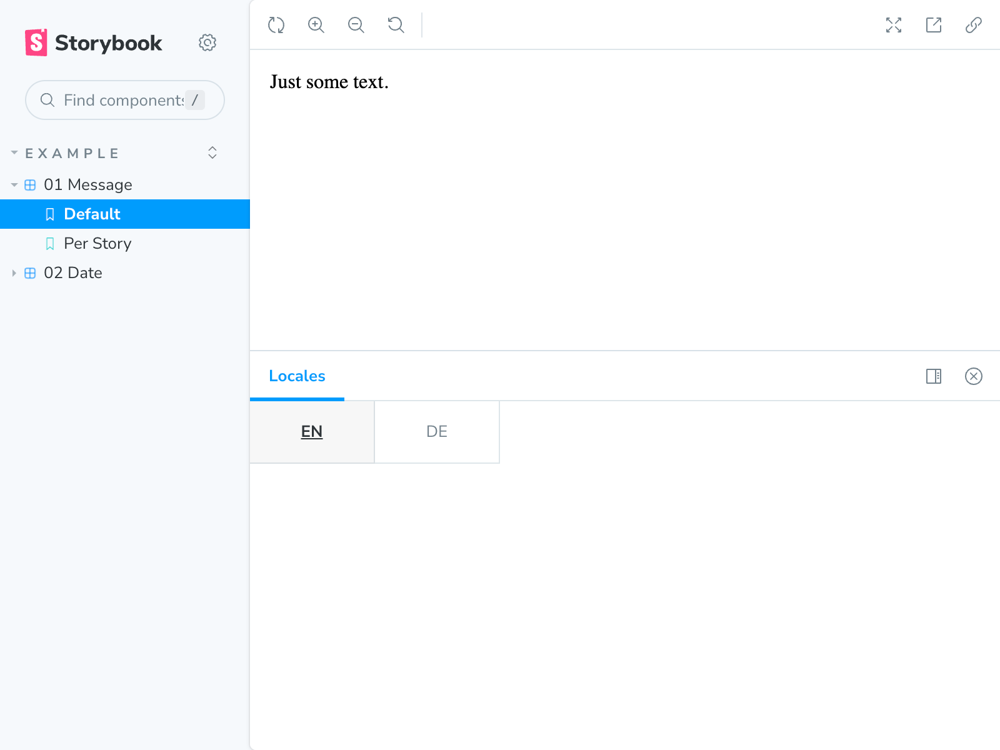

# Storybook Addon Intl

The Intl addon can be used to provide locale switcher and react-intl.



## Getting Started

First, install the addon

```shell
npm install -D storybook-addon-intl
```

Then, add following content to `.storybook/main.js`:

```js
export default {
    addons: ['storybook-addon-intl']
};
```

In `.storybook/preview.js`, add the following:

```js
// Provide your messages
const messages = {
    en: { message: 'Just some text.' },
    de: { message: 'Nur etwas Text.' },
    es: { message: 'Sólo un texto.' }
};

const getMessages = (locale) => messages[locale];

export default {
    parameters: {
        intl: {
            locales: defaultLocales,
            defaultLocale: 'en',
            getMessages
        }
    }
};
```

## Configuration

Parameter key: `intl`

### `locales`

Type: `string[]`

Available locales.

### `defaultLocale`

Type: `string`

Fallback locale.

### `getMessages`

Type: `(locale: string) => object`

Getter function that takes the active locale as arguments and expects an `object` of messages as a return value.

<small>(See `messages` in [`IntlProvider` docs](https://formatjs.io/docs/react-intl/components#intlprovider) of react-intl)</small>

### `getFormats`

Type: `(locale: string) => object`

Getter function that takes the active locale as arguments and expects an `object` of formats as a return value.

<small>(See `formats` in [`IntlProvider` docs](https://formatjs.io/docs/react-intl/components#intlprovider) of react-intl)</small>

### `defaultRichTextElements`

Type: `object`

Object of rich text elements.

<small>(See `defaultRichTextElements` in [`IntlProvider` docs](https://formatjs.io/docs/react-intl/components#intlprovider) of react-intl)</small>
